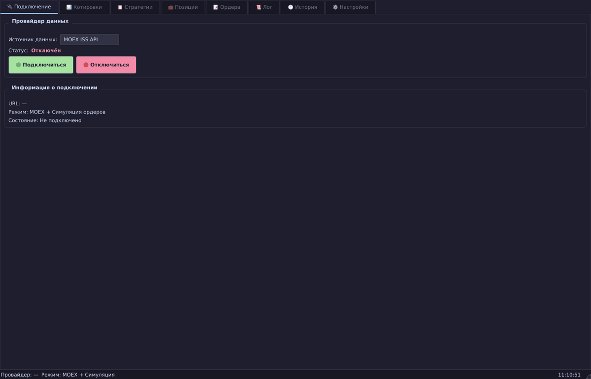

# Options Robot — Торговый робот для опционов MOEX

Автоматизированный робот для торговли опционами на срочном рынке Московской биржи (MOEX) через API брокера Alor.



## 📖 Документация GUI

**Полная документация с описанием всех вкладок и архитектуры: [docs/index.md](docs/index.md)**

## Статус разработки

| Этап | Функциональность | Статус |
|------|-----------------|--------|
| 1. Фундамент | EventBus, MoexDataProvider, SimulatedOrderProvider, GreeksEngine, базовый GUI | ✅ Готово |
| 2. Ядро стратегий | StrategyManager, TriggerEngine, OrderManager, вкладки Стратегии/Ордера/Лог | ✅ Готово |
| 3. Позиции и хедж | Монитор позиций, DeltaHedger интеграция, P&L | 🚧 План |
| 4. Alor API | AlorDataProvider, AlorOrderProvider, RiskManager (боевой) | 🚧 План |
| 5. История и аналитика | История сделок, отчёты, аналитика | 🚧 План |
| 6. Продакшен | Настройки, Telegram-уведомления, упаковка | 🚧 План |

## Архитектура

Модульная архитектура с внутренней шиной событий (Event Bus) и асинхронным GUI (PyQt6 + qasync).

```
core/                  # Бизнес-логика
  providers/           # Провайдеры данных и ордеров
    market_data.py     # Абстрактный MarketDataProvider
    moex_provider.py   # MOEX ISS API (рыночные данные)
    alor_provider.py   # Alor Open API (рыночные данные + ордера)
    simulated_orders.py # Симулятор ордеров (отладка)
  event_bus.py         # Шина событий
  strategy_manager.py  # Управление стратегиями
  trigger_engine.py    # Триггеры по цене БА
  order_manager.py     # Выставление/снятие ордеров
  delta_hedger.py      # Дельта-хеджирование
  greeks_engine.py     # Расчёт греков (Блэк-76)
  risk_manager.py      # SL/TP, контроль рисков
gui/                   # Интерфейс (PyQt6, тёмная тема)
  widgets/             # StrategyTab, OrdersTab, LogTab, StrategyDialog
database/              # SQLite (aiosqlite): стратегии, ордера, сделки
notifications/         # Telegram-уведомления (python-telegram-bot)
utils/                 # Логирование, конфигурация
```

## Установка и запуск

```bash
# Установка зависимостей
python3 -m venv .venv
source .venv/bin/activate
pip install -r requirements.txt

# Запуск GUI
python main.py

# Консольный режим (без GUI)
python main.py --no-gui

# Создание скриншотов GUI (headless)
xvfb-run -a -s "-screen 0 1920x1080x24" .venv/bin/python scripts/screenshot_gui.py
```

## Ключевые технологии

| Слой | Технология |
|------|-----------|
| GUI | PyQt6 + qasync (asyncio ↔ Qt) |
| Данные | aiohttp (MOEX ISS), aiosqlite |
| Математика | numpy, scipy (расчёт греков) |
| События | EventBus (публикация/подписка) |
| Хранение | SQLite (стратегии, ордера, история) |

## Безопасность

- Токены хранятся в зашифрованном виде (Fernet)
- Конфигурация с токенами исключена из Git (settings_local.json в .gitignore)
- Логи не содержат чувствительных данных

## Лицензия

Проприетарное ПО. Для внутреннего использования.
