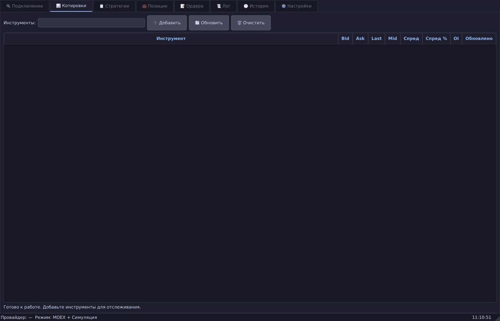
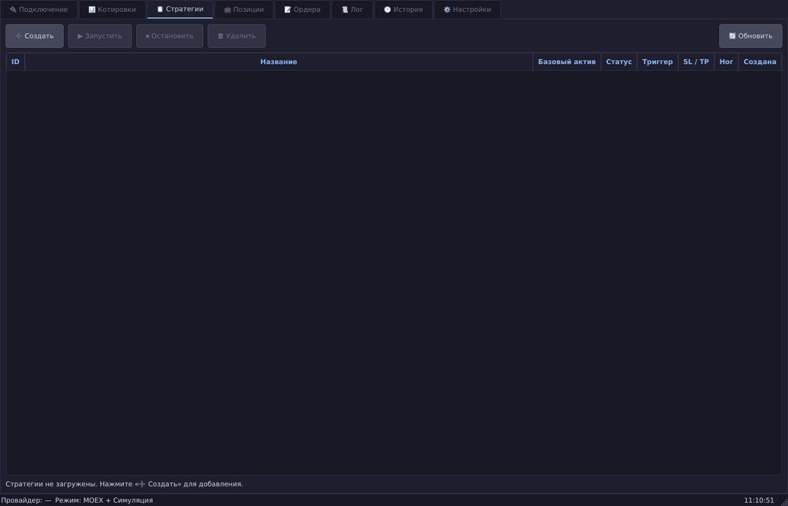
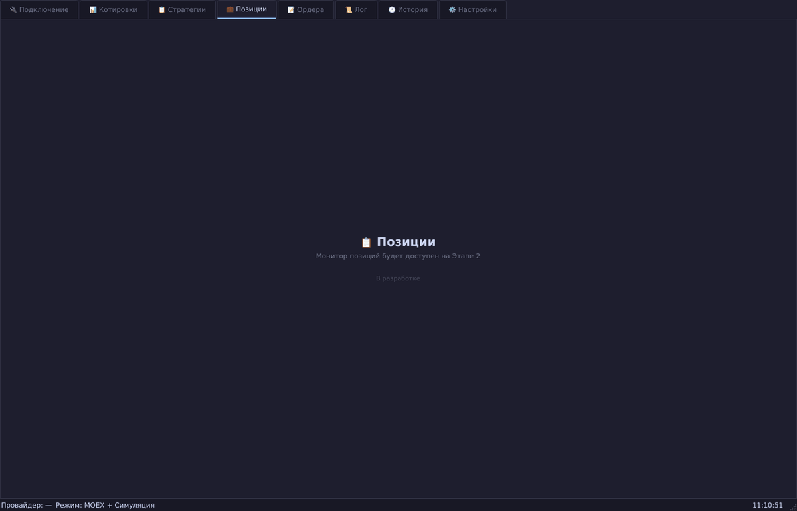
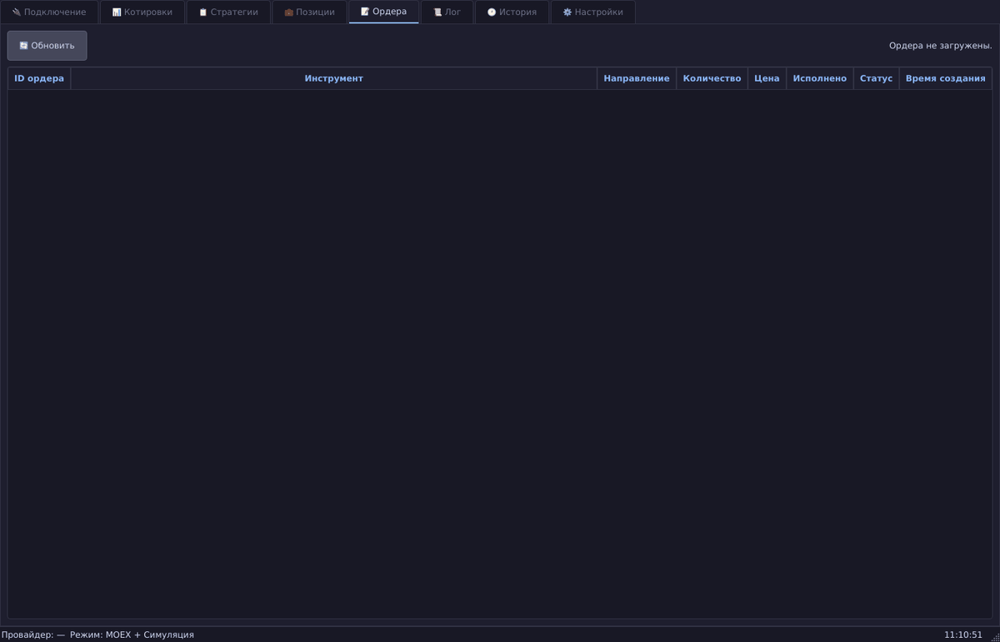
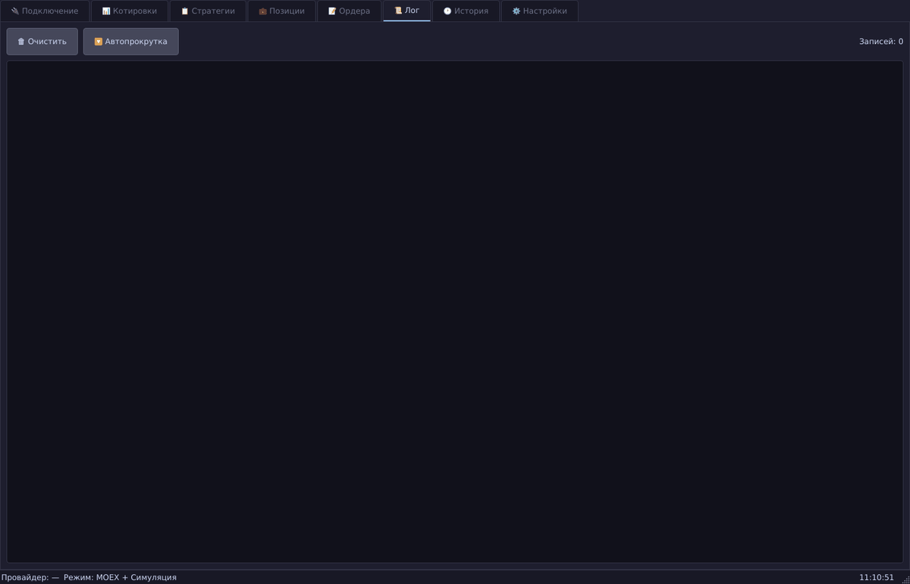
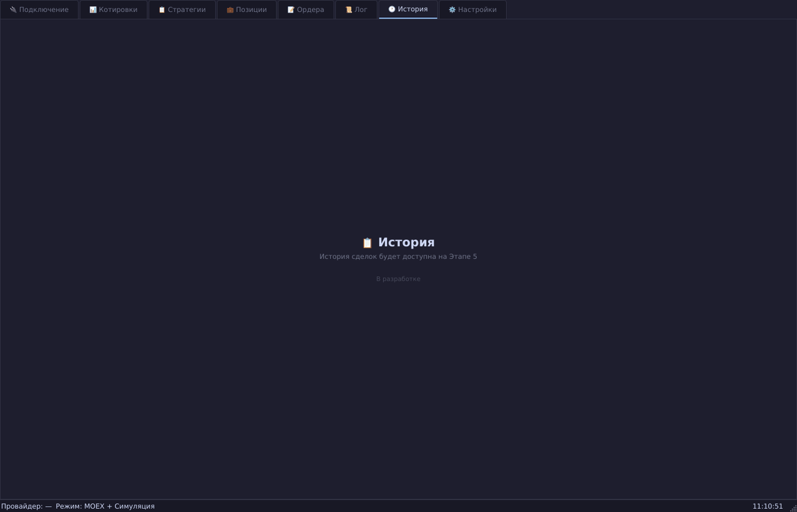
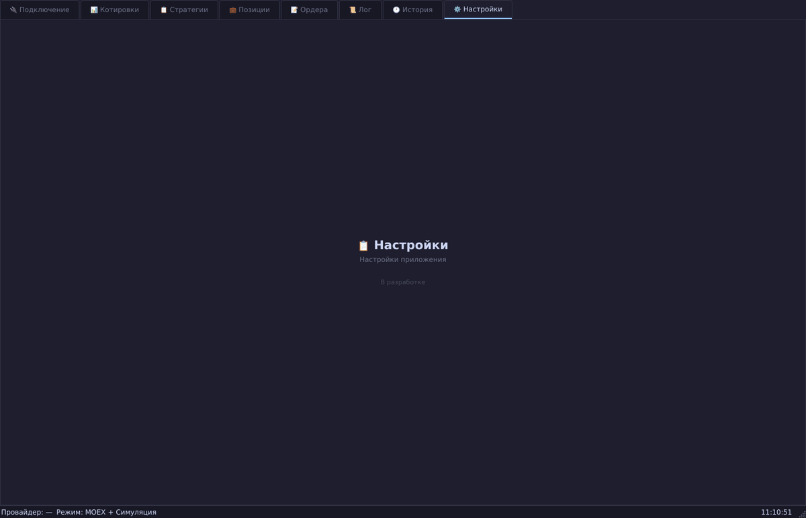

# Options Robot — Архитектура GUI

**Торговый робот для опционов на Московской бирже (MOEX)**

Версия: 0.1.0 | Режим: MOEX Simulation | Тема: Catppuccin Dark (PyQt6)

---

## Обзор интерфейса

Главное окно приложения реализовано на **PyQt6 + qasync** (асинхронный мост между asyncio и Qt event loop). Интерфейс состоит из 8 вкладок, строки состояния и тёмной темы оформления.

### Главное окно

- **Размер:** 1400×900 px (минимум 1024×600)
- **Тема:** Catppuccin Mocha (тёмная)
- **Статус-бар:** провайдер, режим, время


---

## Вкладки

### 1. 🔌 Подключение

Управление подключением к провайдерам рыночных данных и ордеров.

- Выбор источника данных: MOEX ISS API, Alor Demo, Alor Production
- Статус подключения (цветовая индикация: зелёный/красный)
- Кнопки «Подключиться» / «Отключиться»
- Информационная панель: URL, режим, состояние


### 2. 📊 Котировки

Таблица котировок выбранных инструментов.

- Поля: Инструмент, Bid, Ask, Last, Mid, Спред, Спред %, OI, Обновлено
- Добавление инструментов по тикеру (Enter или кнопка «+»)
- Ручное обновление и очистка таблицы
- Чередование цветов строк для читаемости



### 3. 📋 Стратегии

Управление торговыми стратегиями (Этап 2).

- Список активных/приостановленных стратегий
- Создание, редактирование, удаление стратегий
- Диалог настройки параметров стратегии (StrategyDialog)
- Статус-бар по стратегиям: активно/всего



### 4. 💼 Позиции

Мониторинг открытых позиций (запланирован на Этап 3).



### 5. 📝 Ордера

Журнал ордеров и управление заявками (Этап 2).

- Таблица ордеров: ID, инструмент, тип, количество, цена, статус, время
- Цветовая индикация статусов (исполнен/отменён/активен)
- Обновление в реальном времени через EventBus



### 6. 📜 Лог

Системный лог в реальном времени (LogTab).

- Отображение событий из EventBus
- Цветовая маркировка по уровням: DEBUG (серый), INFO (белый), WARNING (жёлтый), ERROR (красный)
- Автопрокрутка к последней записи



### 7. 🕐 История

История сделок (запланирована на Этап 5).



### 8. ⚙️ Настройки

Настройки приложения (запланированы на Этап 6).



---

## Архитектура

### Компонентная схема

```
main.py                          # Точка входа, Application, setup_gui(), run_gui()
  ├── config/settings.json        # Основная конфигурация
  ├── core/
  │   ├── event_bus.py            # Шина событий (публикация/подписка)
  │   ├── greeks_engine.py        # Расчёт греков (Блэк-76)
  │   ├── strategy_manager.py     # Менеджер стратегий
  │   ├── trigger_engine.py       # Движок срабатывания триггеров
  │   ├── order_manager.py        # Менеджер ордеров
  │   ├── delta_hedger.py         # Дельта-хеджер
  │   ├── risk_manager.py         # Риск-менеджер
  │   └── providers/
  │       ├── market_data.py      # Абстрактный MarketDataProvider
  │       ├── moex_provider.py    # MOEX ISS API (реализация)
  │       ├── alor_provider.py    # Alor API (заглушка)
  │       └── simulated_orders.py # Симулятор ордеров
  ├── gui/
  │   ├── main_window.py          # MainWindow + ConnectionTab + QuotesTab
  │   └── widgets/
  │       ├── strategy_tab.py     # Вкладка «Стратегии»
  │       ├── strategy_dialog.py  # Диалог настройки стратегии
  │       ├── orders_tab.py       # Вкладка «Ордера»
  │       └── log_tab.py          # Вкладка «Лог»
  ├── database/
  │   └── db_manager.py           # SQLite через aiosqlite
  ├── utils/
  │   └── logger.py               # Настройка логирования
  └── notifications/              # Telegram-уведомления
```

### Поток данных

```
MOEX ISS API ──→ MoexDataProvider ──→ EventBus ──→ GUI (QuotesTab)
                                 ──→ TriggerEngine ──→ OrderManager
                                                 ──→ GUI (OrdersTab)
StrategyManager ──→ EventBus ──→ GUI (StrategyTab)
DeltaHedger, RiskManager ──→ EventBus ──→ GUI (LogTab)
```

### Ключевые технологии

| Слой | Технология |
|------|-----------|
| GUI | PyQt6 + qasync (asyncio ↔ Qt) |
| Данные | aiohttp (MOEX ISS), aiosqlite |
| Математика | numpy, scipy (расчёт греков) |
| События | EventBus (публикация/подписка) |
| Хранение | SQLite (стратегии, ордера, история) |

---

## Запуск

```bash
# Установка
python3 -m venv .venv
source .venv/bin/activate
pip install -r requirements.txt

# Запуск GUI
python main.py

# Консольный режим (без GUI)
python main.py --no-gui

# Создание скриншотов (headless)
xvfb-run -a -s "-screen 0 1920x1080x24" .venv/bin/python scripts/screenshot_gui.py
```

---

## Этапы разработки

| Этап | Содержание | Статус |
|------|-----------|--------|
| 1 | EventBus, MoexDataProvider, SimulatedOrderProvider, GreeksEngine, Базовый GUI | ✅ Готово |
| 2 | StrategyManager, TriggerEngine, OrderManager, StrategyTab, OrdersTab | ✅ Готово |
| 3 | Монитор позиций, DeltaHedger интеграция | 🚧 Планируется |
| 4 | Alor API (реальные ордера), RiskManager | 🚧 Планируется |
| 5 | История сделок, аналитика | 🚧 Планируется |
| 6 | Настройки, Telegram-уведомления, продакшен | 🚧 Планируется |

---

*Документация сгенерирована автоматически. Последнее обновление: 2026-06-01.*
